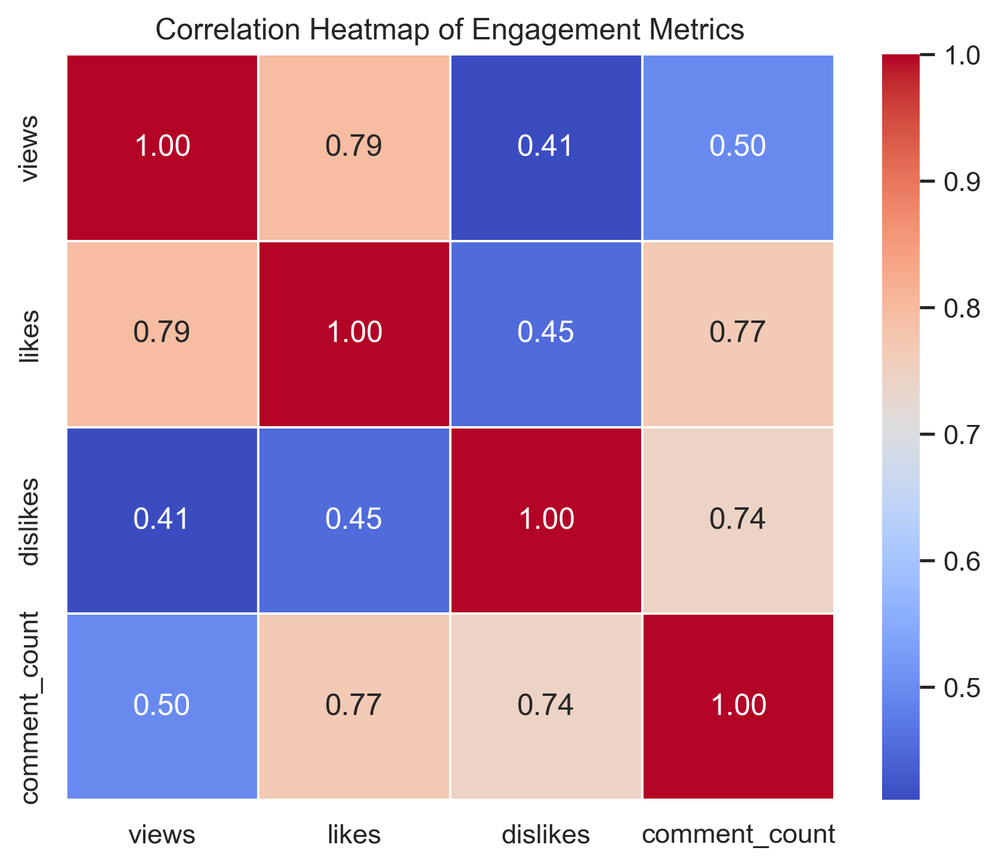
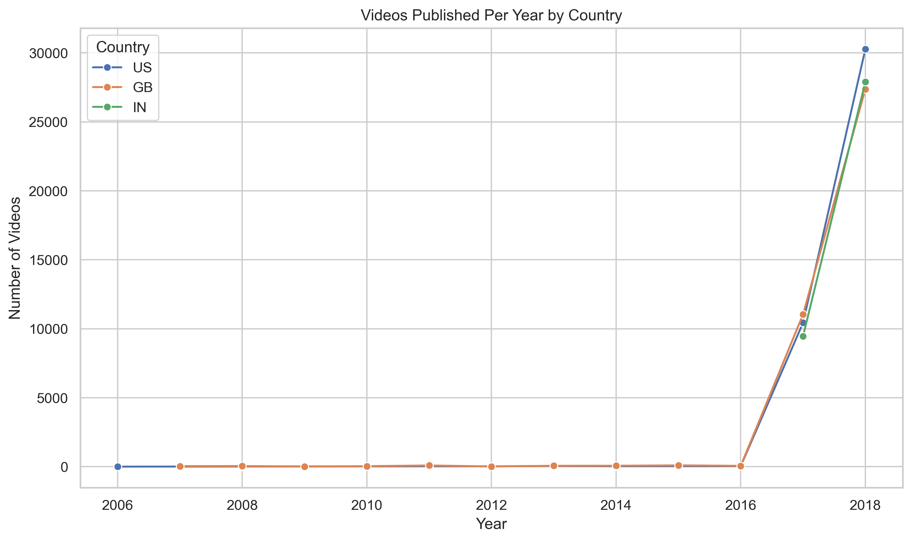

# LargeDatasetQuery-Optimisation

This project explores how to **work with large real-world datasets (100k+ records)** and focuses on **efficient storage, querying, optimisation, and visual analysis** rather than just basic data analysis.

The goal was to understand **how data behaves at scale** and how thoughtful design decisions (batching, indexing, sampling, log-scales) improve performance and clarity.

## Dataset Overview

- **Source:** Kaggle – YouTube Trending Videos Dataset  
- **Total Records:** **106,687**
- **Regions Covered:**
  - United States (US)
  - India (IN)
  - Great Britain (GB)

  Each record contains metadata such as views, likes, comments, publish time, and category information.

> Raw CSV files are excluded from the repository due to size constraints.  
> The dataset source is publicly available on Kaggle.

##  Tech Stack

- **Python**
- **Pandas & NumPy** – data cleaning & manipulation  
- **MongoDB** – large-scale data storage  
- **PyMongo** – database interaction  
- **Matplotlib & Seaborn** – visual analytics  
- **Jupyter Notebook** – exploration & visualization  

##  What This Project Covers

### 1️. Data Preparation
- Merged multiple regional CSV files into a single dataset
- Cleaned missing values and removed duplicates
- Converted publish timestamps to datetime format
- Added country-level identifiers for comparative analysis

### 2️. Large-Scale Database Storage
- Loaded **100k+ records** into MongoDB
- Used **batch insertion** to handle large data efficiently
- Verified data integrity using MongoDB shell (`mongosh`)

### 3️. Query Optimisation
- Created indexes on frequently queried fields:
  - `views`
  - `publish_time`
  - `channel_title`
- Implemented:
  - Pagination queries
  - Aggregation pipelines
- Analysed how indexing improves query performance on large collections

### 4️. Data Visualisation & Insights
Visualisations were designed to **handle scale**, avoid clutter, and highlight meaningful patterns.

##  Visual Analytics

###  Views vs Likes (Country-wise, Log Scale)
Shows engagement patterns across regions while handling extreme value ranges.

###  Correlation Heatmap of Engagement Metrics
Highlights relationships between views, likes, dislikes, and comments.

###  Videos Published Per Year by Country
A multi-line time-series comparison of content publishing trends.

##  Key Learnings

- Large datasets require **different thinking** compared to small CSV analysis
- Indexing significantly impacts query performance at scale
- Raw distributions can be misleading without **log transformations**
- Sampling is essential for scalable visual analytics
- Visual clarity matters as much as backend efficiency

##  Future Enhancements

This project establishes a strong foundation for working with large datasets.  
Some planned improvements and extensions include:

- **REST API Layer**  
  Expose optimized MongoDB queries (pagination, aggregation) through REST APIs using Node.js or FastAPI for scalable data access.

- **Performance Benchmarking**  
  Measure and compare query execution times with and without indexing to quantitatively demonstrate performance gains.

- **Interactive Dashboard**  
  Build an interactive dashboard (Streamlit or React + Chart.js) to explore trends and insights dynamically instead of static plots.

- **Advanced Aggregations**  
  Add more complex aggregation pipelines such as:
  - Category-wise engagement analysis  
  - Time-based rolling averages  
  - Country-wise growth comparisons

- **Cloud Deployment**  
  Deploy the database and APIs using cloud services (MongoDB Atlas, Render, or AWS) to simulate production-scale environments.

- **Automated Data Pipeline**  
  Introduce scheduled data ingestion and updates to handle continuously growing datasets.

